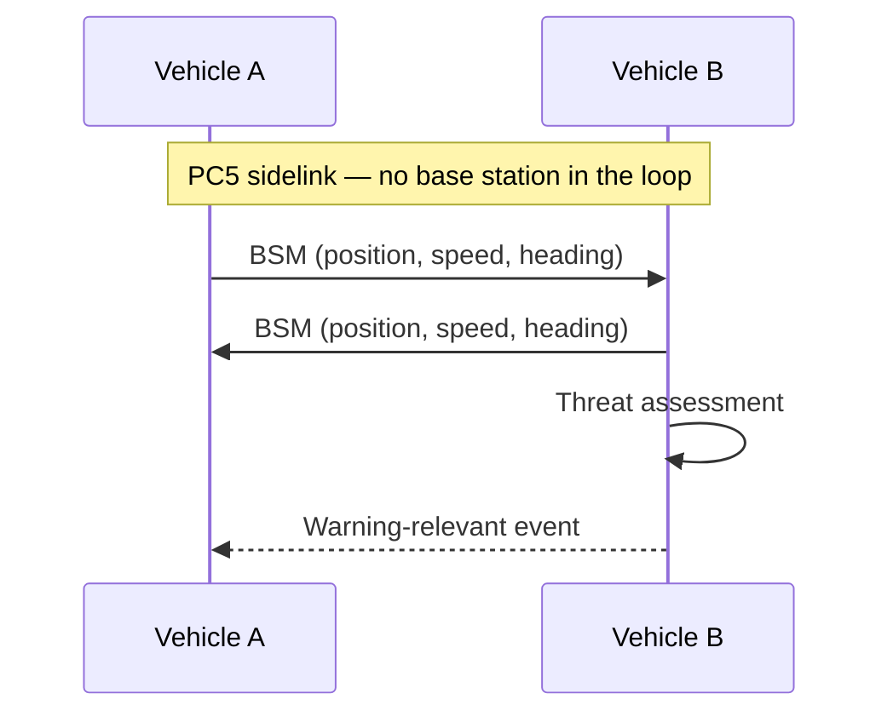

This blog will collect perspectives from the areas I work in — connected
driving, robotics, AI, and the systems underneath them. Arguments in those
fields tend to need more than prose: an equation, a message flow, a snippet of
RTL. So before writing anything real, this first post checks that all of those
render the way they should. It doubles as the template I copy for every new
post.

## 1. Equations

Inline math sits in the sentence, like the free-space path loss at distance
$d$ and frequency $f$: $\mathrm{FSPL} = \left(\tfrac{4\pi d f}{c}\right)^2$.
Display math gets its own line:

$$
C = B \log_2\!\left(1 + \frac{P_r}{N_0 B}\right)
$$

Shannon capacity is a useful sanity bound in any link-budget argument: given a
received power $P_r$ over bandwidth $B$, no waveform trick gets you above
$C$ — it only decides how gracefully you approach it.

## 2. Diagrams

Diagrams are written as fenced Mermaid blocks and rendered in the browser,
matching the site theme. A V2V safety exchange over the PC5 sidelink:



## 3. Code

Code blocks are highlighted at build time, in both themes. Since this site is
partly a story about FPGAs, the demo is VHDL — a two-stage pipeline register,
the kind of thing you write a hundred times when closing timing:

```vhdl
process (clk)
begin
  if rising_edge(clk) then
    if rst = '1' then
      data_p1 <= (others => '0');
      data_p2 <= (others => '0');
    else
      data_p1 <= data_in;   -- stage 1
      data_p2 <= data_p1;   -- stage 2
    end if;
  end if;
end process;
```

The rest of the toolbox renders too. SystemVerilog, for the verification side —
an assertion that data holds until it's accepted:

```systemverilog
property p_no_drop;
  @(posedge clk) disable iff (!rst_n)
  valid && !ready |=> valid;   // hold until accepted
endproperty
assert property (p_no_drop);
```

C++ on the software side of the boundary — a saturating fixed-point
accumulator, the arithmetic RTL and reference model must agree on:

```cpp
int16_t acc_sat(int32_t acc, int16_t x) {
  acc += x;
  if (acc > INT16_MAX) return INT16_MAX;
  if (acc < INT16_MIN) return INT16_MIN;
  return static_cast<int16_t>(acc);
}
```

Python for the quick numerical sanity check:

```python
import numpy as np

def fspl_db(d_km: float, f_ghz: float) -> float:
    return 20 * np.log10(d_km) + 20 * np.log10(f_ghz) + 92.45

assert abs(fspl_db(1.0, 3.5) - 103.3) < 0.1
```

MATLAB, where the golden reference usually lives:

```matlab
% golden reference vs. RTL capture
err = max(abs(y_ref - y_rtl));
assert(err < 2^-14, 'RTL diverges from reference: %g', err);
```

Tcl, because no FPGA flow escapes it:

```tcl
create_clock -period 3.333 -name sys_clk [get_ports clk_p]
set_false_path -from [get_clocks sys_clk] -to [get_clocks axi_clk]
report_timing_summary -file timing.rpt
```

Bash for the glue:

```bash
vivado -mode batch -source build.tcl |& tee build.log
grep -E 'WNS|TNS' build.log   # did we close timing?
```

And JSON for the configs that hold a simulation scenario together:

```json
{
  "scenario": "urban-intersection",
  "vehicles": 12,
  "channel": { "model": "TR38.901-UMa", "fc_ghz": 5.9 },
  "seed": 42
}
```

## 4. Tables

| Interface | Path | Latency profile | Coverage needed |
| --------- | ---- | --------------- | --------------- |
| Uu | vehicle → network → vehicle | tens of ms, variable | yes |
| PC5 | vehicle → vehicle | few ms, direct | no |

## 5. Figures

Figures can be plain markdown images, or inline SVG when they should follow
the site theme:

<figure>
  <svg viewBox="0 0 600 150" role="img" aria-label="A sampled pulse waveform">
    <line x1="0" y1="75" x2="600" y2="75" stroke="var(--hairline)" />
    <polyline
      fill="none"
      stroke="var(--accent)"
      stroke-width="2"
      points="0,75 30,73 60,78 90,68 120,85 150,55 180,105 210,20 240,130 270,10 300,75 330,10 360,130 390,20 420,105 450,55 480,85 510,68 540,78 570,73 600,75"
    />
  </svg>
  <figcaption>An inline SVG figure — it inherits the theme's colors.</figcaption>
</figure>

## 6. Quotes

> Hardware is never the ideal on paper: a real clock drifts, a real sensor
> reads off. The interesting engineering starts where the model stops.

That's the whole pipeline verified — math, diagrams, code, tables, figures.
Real posts start from here.
