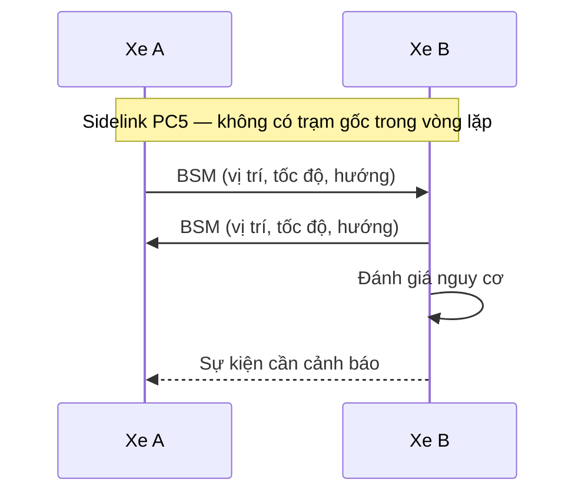

Blog này sẽ là nơi tôi chia sẻ góc nhìn từ những mảng mình làm việc — connected
driving, robotics, AI, và các hệ thống bên dưới chúng. Lập luận trong những
lĩnh vực đó thường cần nhiều hơn văn xuôi: một phương trình, một luồng bản
tin, một đoạn RTL. Vậy nên trước khi viết gì "thật", bài đầu tiên này kiểm tra
xem tất cả những thứ đó có render đúng như mong đợi không. Nó đồng thời là
template tôi copy cho mọi bài sau.

## Công thức

Công thức inline nằm ngay trong câu, như suy hao không gian tự do ở khoảng
cách $d$ và tần số $f$: $\mathrm{FSPL} = \left(\tfrac{4\pi d f}{c}\right)^2$.
Công thức display có dòng riêng:

$$
C = B \log_2\!\left(1 + \frac{P_r}{N_0 B}\right)
$$

Dung lượng Shannon là chặn trên hữu ích trong mọi lập luận về link budget: với
công suất thu $P_r$ trên băng thông $B$, không mẹo waveform nào đưa bạn vượt
qua $C$ — nó chỉ quyết định bạn tiến đến gần giới hạn đó "êm" tới mức nào.

## Sơ đồ

Sơ đồ được viết bằng khối Mermaid và render ngay trên trình duyệt, khớp với
theme của site. Một phiên trao đổi an toàn V2V qua sidelink PC5:



## Code

Code block được highlight lúc build, ở cả hai theme. Vì site này một phần là
câu chuyện về FPGA, đoạn demo là VHDL — một thanh ghi pipeline hai tầng, thứ
bạn viết cả trăm lần khi đóng timing:

```vhdl
process (clk)
begin
  if rising_edge(clk) then
    if rst = '1' then
      data_p1 <= (others => '0');
      data_p2 <= (others => '0');
    else
      data_p1 <= data_in;   -- tầng 1
      data_p2 <= data_p1;   -- tầng 2
    end if;
  end if;
end process;
```

## Bảng

| Giao diện | Đường đi | Đặc tính độ trễ | Cần vùng phủ |
| --------- | -------- | ---------------- | ------------ |
| Uu | xe → mạng → xe | hàng chục ms, dao động | có |
| PC5 | xe → xe | vài ms, trực tiếp | không |

## Hình vẽ

Hình có thể là ảnh markdown thông thường, hoặc SVG inline khi cần bám theo
theme của site:

<figure>
  <svg viewBox="0 0 600 150" role="img" aria-label="Một xung được lấy mẫu">
    <line x1="0" y1="75" x2="600" y2="75" stroke="var(--hairline)" />
    <polyline
      fill="none"
      stroke="var(--accent)"
      stroke-width="2"
      points="0,75 30,73 60,78 90,68 120,85 150,55 180,105 210,20 240,130 270,10 300,75 330,10 360,130 390,20 420,105 450,55 480,85 510,68 540,78 570,73 600,75"
    />
  </svg>
  <figcaption>Hình SVG inline — tự kế thừa màu của theme.</figcaption>
</figure>

## Trích dẫn

> Phần cứng không bao giờ là bản lý tưởng trên giấy: clock thật thì trôi,
> cảm biến thật thì lệch. Phần kỹ thuật thú vị bắt đầu ở nơi mô hình dừng lại.

Vậy là cả pipeline đã được kiểm chứng — toán, sơ đồ, code, bảng, hình vẽ.
Những bài viết thật bắt đầu từ đây.
